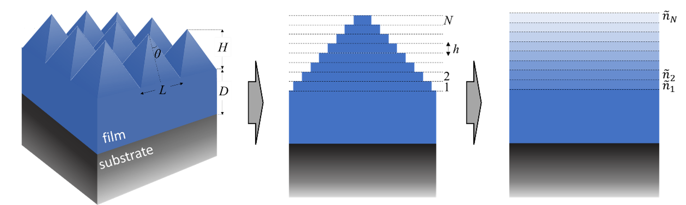
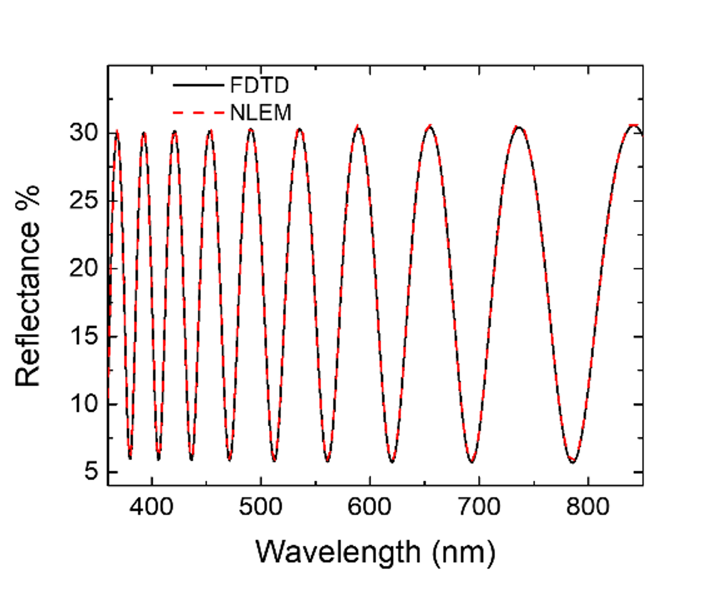

<div id="top"></div>


<!-- PROJECT LOGO -->
<br />
<div align="center">
  <a href="https://github.com/RiaLampad/NLEM">
    
  </a>
</div>


<!-- ABOUT THE PROJECT -->
## Model description


The NLEM model is a nonlocal effective medium model that predicts the morphology of the roughness (height and shape). The software discretizes the roughness into layers and based on the transfer matrix method (TMM) calculates the final reflectance of the system. Moreover, numerically optimization methods are used to predict the value of the rough height and shape which minimize the error function and thus a good convergence between the calculated and the refernce reflectance (see accepted manuscript) is achieved.


## Citation

**If you use NLEM in your work, we ask that you please cite the following article**

Eleftheria Lampadariou , Konstantinos Kaklamanis , Dimitrios Goustouridis , Ioannis Raptis , Elefterios Lidorikis, *"Nonlocal effective medium (NLEM) for quantitative modelling of nanoroughness in spectroscopic reflectance"*, 2022 (**accepted manuscript in Photonics**)


### Prerequisites
  ```
  The source code must be compiled with the icc Intel® compiler (Linux OS)
  ```

### Installation
Run the following commands inside Source directory:
'''
shell
icc *.cpp local_minimization/*.cpp
mv a.out NLEM
'''


### Keyword reference manual

For the basic keywords, please refer to the [NLEM manual](https://github.com/RiaLampad/NLEM/blob/main/Manual/MANUAL_for_code.pdf)_


### Running Example

 ```
1. Create a simulation direcotry, e.g. Rough_1
2. Make a copy of files contained in the direcotry Input_data inside the directory Rough_1
3. Run the executable `NLEM` inside the direcotry Rough_1
 ```
Below is an example where the NLEM model characterizes the morphology of the rough surface of a thin film with height H=32 nm, period of the square based pyramids L=32 nm and shape s=1 . The thin film is SiO2 with thickness 2um placed on a substrate of Si. The calculated reflectance of FDTD method is contained in file R_data. The input file that corresponds to the aforementioned specifications, follows. 

```shell
#reflectance file
REFLECTANCE R_data
#
# define structure: material, thickness [nm], if to be fitted (0/1)
MATERIAL air     0       0
MATERIAL SiO2    2000    1
MATERIAL Si      0       0
#
# define fitting: type, value (0/1)
FIT_TYPE ROUGHNESS            1
#
# define fit limits and models
FIT_LIMITS  RUNS_NUM    10
FIT_LIMITS  ROUGH_LRS   30
FIT_LIMITS  LAMDA_MIN   300.0
FIT_LIMITS  LAMDA_MAX   1200
FIT_LIMITS  LAMDA_NUM   1200
#
# define fit parameters: initial, min value, max value
FIT_PARAM ROUGH 32 32 32   #roughness height (nm)
FIT_PARAM ROUGH 0.5 0.0 2.0 #roughness shape (0-5)
#
# other parameters
EMT_PARAM       PMAX    5.5080  1.8221  -0.2326         #slice pmax
EMT_PARAM       GAMM    -18.493 -1.0616  0.0            #slice gamma
EMT_PARAM       DELT    0.5690  0.039   -0.0053         #slice delta
EMT_PARAM       SEMI    1.2500  0.0     0.0             #semi-infinite
#
WEIGHT_PARAM    BETA   0.0166   0.0041  0
WEIGHT_PARAM    ALPHA   -0.4762   0.091   0
#
# other options
OPTION          PRINT   1               #print info on screen
OPTION          SMOOTH  0               #smooth reflection measured data
#
```

The **expected results** for the NLEM reflectance in comparison to the reference reflectance are shown in the figure below: 

<br />
<div align="center">
  <a href="https://github.com/RiaLampad/NLEM">
    
  </a>
</div>


## Contact

Feel free to contact us for any questions

1. Eleftheria Lampadariou   - lampadariou.ele@gmail.com
2. Konstantinos Kaklamanis  - k.kaklamanis@uoi.gr


